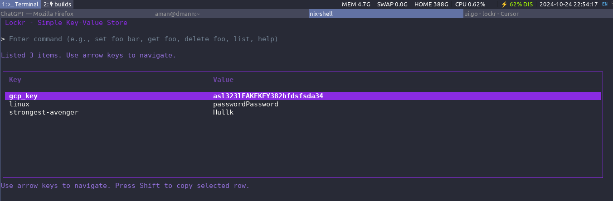

# Lockr

Lockr is a simple key-value store implemented using a Log-Structured Merge (LSM) tree in Go.


## Features

- In-memory storage with disk persistence
- Basic CRUD operations: Set, Get, Delete
- List all key-value pairs
- Command-line interface

## Installation

1. Ensure you have Go installed on your system.
2. Clone the repository:
   ```
   git clone https://github.com/yourusername/Lockr.git
   ```
3. Navigate to the project directory:
   ```
   cd Lockr
   ```

## Usage

Run the Lockr CLI:
```
go run bin/cli/cli.go
```

### Commands

- `set <key> <value>`: Set a key-value pair
- `get <key>`: Retrieve the value for a key
- `delete <key>`: Delete a key-value pair
- `list all`: Display all key-value pairs
- `exit` or `quit`: Exit the program

## Example

```
Lockr> set mykey myvalue
Set mykey to myvalue
Lockr> get mykey
myvalue
Lockr> list
mykey: myvalue
Lockr> delete mykey
Deleted mykey
Lockr> exit
```

## Development

To run tests:
```
go test ./tests/...
```

## License

This project is licensed under the MIT License.